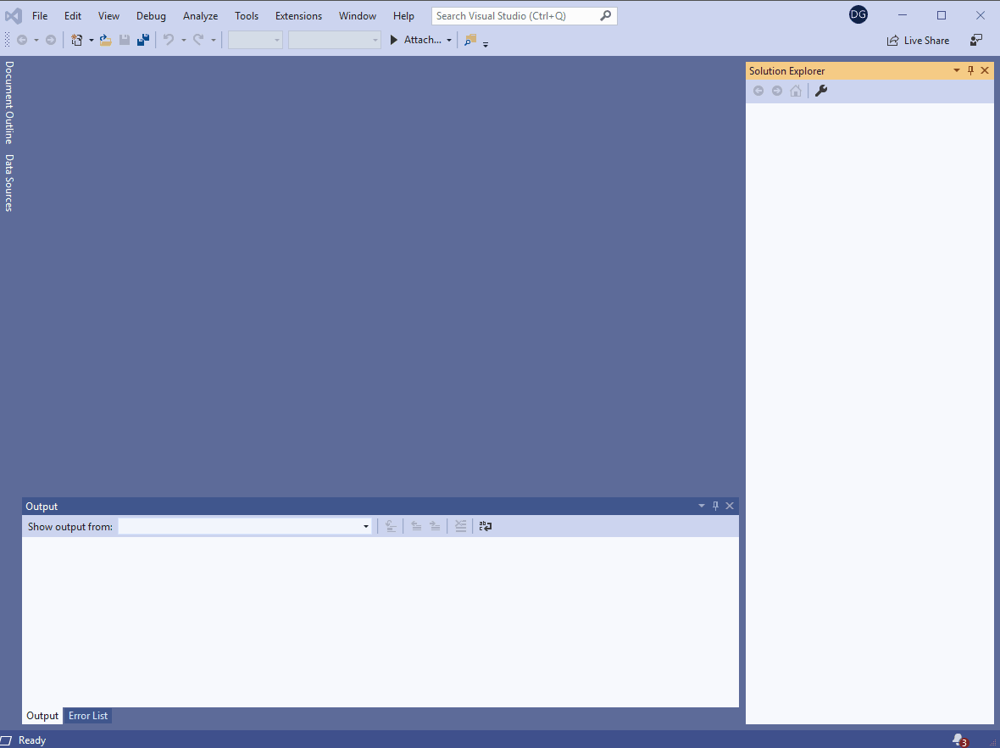

# First Steps

In this getting started guide, we create a simple application that uses the Telerik Document Processing libraries to create a DOCX document and then export it as a PDF file.

The Telerik Document Processing libraries that we use in this guide are UI-independent and cover all .NET technologies, from desktop and web to mobile. They can also be deployed in client, server-side and cloud apps.

## Step 1: Installing on Your Computer

Since we distribute Telerik Document Processing libraries as an addition to several Telerik UI component bundles, chances are that the libraries are already installed on your system. In this case, all you need is to locate them. The table below provides links to the installation instructions for each of the Telerik UI component suites that give you access to the Telerik Document Processing libraries. If the standard installation of your Telerik UI component suite includes the Document Processing assemblies, the table also shows their default location.

>tipRegardless of the Telerik UI components suite that you use, you can always get the Document Processing assemblies as NuGet packages from the [Telerik NuGet server]().

> The improved Telerik NuGet v3 is now available for beta testing at https://nuget.telerik.com/v3/index.json. The new v3 API is faster, lighter, and reduces the number of requests from NuGet clients. You are welcome to try it.

| UI Components suite | Installation instructions | Default location of the Document Processing assemblies |
|--------------------|---------------------------|------------------------------------------------|
| UI for ASP.NET AJAX | [Installing Telerik UI for ASP.NET AJAX](http://docs.telerik.com/devtools/aspnet-ajax/installation/which-file-do-i-need-to-install) | <ul><li>`C:\Program Files (x86)\Progress\Telerik UI for ASP.NET AJAX [version]\AdditionalLibraries\Bin40`</li><li>`C:\Program Files (x86)\Progress\Telerik UI for ASP.NET AJAX [version]\AdditionalLibraries\Bin45`</li></ul> |
| UI for ASP.NET MVC | [Installing Telerik UI for ASP.NET MVC](http://docs.telerik.com/kendo-ui/aspnet-mvc/introduction#installation) |  <ul><li>`C:\Program Files (x86)\Progress\Telerik UI for ASP.NET MVC [version]\dpl\net40`</li><li>`C:\Program Files (x86)\Progress\Telerik UI for ASP.NET MVC [version]\dpl\netstandard`</li></ul> |
| UI for ASP.NET Core | [Installing Telerik UI for ASP.NET Core](https://docs.telerik.com/aspnet-core/getting-started/installation/document-processing) | The Telerik Document Processing libraries are available as NuGet packages on the Telerik NuGet server: https://nuget.telerik.com/nuget. |
| UI for Blazor | [Installing Telerik UI for Blazor](https://docs.telerik.com/blazor-ui/common-features/document-processing) | The Telerik Document Processing libraries are available as NuGet packages on the Telerik NuGet server: https://nuget.telerik.com/nuget. |
| UI for WPF | [Installing Telerik UI for WPF](http://docs.telerik.com/devtools/wpf/installation-and-deployment/installing-telerik-ui-on-your-computer/installation-installing-which-file-do-i-need.html) | <ul><li>`C:\Program Files (x86)\Progress\Telerik UI for WPF [version]\Binaries`</li><li>`C:\Program Files (x86)\Progress\Telerik UI for WPF [version]\Binaries.NoXaml`</li></ul> |
| UI for Silverlight | [Installing Telerik UI for Silverlight](http://docs.telerik.com/devtools/silverlight/installation-and-deployment/installing-telerik-ui-on-your-computer/installation-installing-which-file-do-i-need.html) | <ul><li>`C:\Program Files (x86)\Progress\Telerik UI for WPF [version]\Binaries\Silverlight`</li><li>`C:\Program Files (x86)\Progress\Telerik UI for WPF [version]\Binaries.NoXaml\Silverlight`</li></ul> |
| UI for WinForms | [Installing Telerik UI for WinForms](http://docs.telerik.com/devtools/winforms/installation-deployment-and-distribution/installing-on-your-computer) | <ul><li>`C:\Program Files (x86)\Progress\Telerik UI for WinForms [version]\Bin40`</li><li>`C:\Program Files (x86)\Progress\Telerik UI for WinForms [version]\Bin50`</li><li>`C:\Program Files (x86)\Progress\Telerik UI for WinForms [version]\BinNetCore`</li></ul> |
| UI for Xamarin | [Installing Telerik UI for Xamarin](https://docs.telerik.com/devtools/xamarin/installation-and-deployment/system-requirements) | `C:\Program Files (x86)\Progress\Telerik UI for Xamarin [version]\Binaries\Portable`|
| UI for WinUI | [Installing Telerik UI for WinUI](https://docs.telerik.com/devtools/winui/installation-and-deployment/installationsteps) | `C:\Program Files (x86)\Progress\Telerik UI for WinUI [version]\DPL`|

## Step 2: Creating Application with Visual Studio

As we are going to create a UI-Independent example, we will use a console project for this guide:

* Open Microsoft Visual Studio and create a new console project.

#### __Figure 1: Go to File > New > Project > Console App (.Net Framework) > Next > Create__

## Step 3: Add a Telerik Document Processing Library to a Project

This sample application will use [RadWordsProcessing](). In this step, we must add the required assemblies.

1. Reference the assemblies that provide the __RadWordsProcessing__ functionality:

  * __Telerik.Windows.Documents.Core.dll__
  * __Telerik.Windows.Documents.Flow.dll__
  * __Telerik.Windows.Zip.dll__

1. Reference the assemblies that allow you to export the content as Docx and PDF files:

  * __Telerik.Windows.Documents.Flow.FormatProviders.Docx.dll__
  * __Telerik.Windows.Documents.Flow.FormatProviders.Pdf.dll__

> The Document Processing assemblies for .NET Core don't contain "Windows" in their names.

## Step 4: Create a Document

#### __[C#] Example 1: Create RadFlowDocument__

{{region cs-radwordsprocessing-getting-started_0}}
	Telerik.Windows.Documents.Flow.Model.RadFlowDocument document = new Telerik.Windows.Documents.Flow.Model.RadFlowDocument();
	Telerik.Windows.Documents.Flow.Model.Editing.RadFlowDocumentEditor editor = new Telerik.Windows.Documents.Flow.Model.Editing.RadFlowDocumentEditor(document);
	editor.InsertText("Hello world!");
{{endregion}}

#### __[VB.NET] Example 1: Create RadFlowDocument__

{{region cs-radwordsprocessing-getting-started_0}}
    Dim document As Telerik.Windows.Documents.Flow.Model.RadFlowDocument = New Telerik.Windows.Documents.Flow.Model.RadFlowDocument()
    Dim editor As Telerik.Windows.Documents.Flow.Model.Editing.RadFlowDocumentEditor = New Telerik.Windows.Documents.Flow.Model.Editing.RadFlowDocumentEditor(document)
    editor.InsertText("Hello world!")
{{endregion}}

## Step 5: Export the Generated Document

### Export the RadFlowDocument to DOCX

To export the document as a docx file, use [DocxFormatProvider](). Using the below code will create a provider instance and save a document with it. The document will be exported in the bin folder of your current project.
        

#### __[C#] Example 2: Export RadFlowDocument to DOCX__

{{region cs-radwordsprocessing-getting-started_1}}
	using (Stream output = new FileStream("output.docx", FileMode.OpenOrCreate))
	{
	    Telerik.Windows.Documents.Flow.FormatProviders.Docx.DocxFormatProvider provider = new Telerik.Windows.Documents.Flow.FormatProviders.Docx.DocxFormatProvider();
	    provider.Export(document, output);
	}
{{endregion}}

#### __[VB.NET] Example 2: Export RadFlowDocument to DOCX__

{{region cs-radwordsprocessing-getting-started_0}}
	Using output As Stream = New FileStream("output.docx", FileMode.OpenOrCreate)
        Dim provider As Telerik.Windows.Documents.Flow.FormatProviders.Docx.DocxFormatProvider = New Telerik.Windows.Documents.Flow.FormatProviders.Docx.DocxFormatProvider()
        provider.Export(document, output)
    End Using
{{endregion}}

### Export the RadFlowDocument to PDF

To export the document as a PDF file, use [PdfFormatProvider](). __Example 3__ shows how to export the __RadFlowDocument__  created in Examples 1 to a file.
        
#### __[C#] Example 3: Export RadFlowDocument to PDF__

{{region cs-radpdfprocessing-getting-started_2}}
	using (Stream output = File.OpenWrite("Output.pdf"))
    {
		Telerik.Windows.Documents.Flow.FormatProviders.Pdf.PdfFormatProvider providerPDF = new Telerik.Windows.Documents.Flow.FormatProviders.Pdf.PdfFormatProvider();
        providerPDF.Export(document, output);
	}
{{endregion}}

#### __[VB.NET] Example 2: Export RadFlowDocument to PDF__

{{region cs-radwordsprocessing-getting-started_0}}
	Using output As Stream = File.OpenWrite("Output.pdf")
        Dim providerPDF As Telerik.Windows.Documents.Flow.FormatProviders.Pdf.PdfFormatProvider = New Telerik.Windows.Documents.Flow.FormatProviders.Pdf.PdfFormatProvider()
        providerPDF.Export(document, output)
    End Using
{{endregion}}

Run the project and you should see something like this:
#### __Figure 2: The final result__

## Next Steps

Now that you have run your first project example with Telerik Document Processing Libraries, you may want to explore some additional features like __clone, edit, merge, insert__ documents and more. Below you can find guidance on getting started with such tasks:

* [Explore Features]()
* [Further Information]()

## See Also

* [System Requirements]()
* [Installing on your computer]()
* [Document Processing SDK Examples](https://github.com/telerik/document-processing-sdk)
