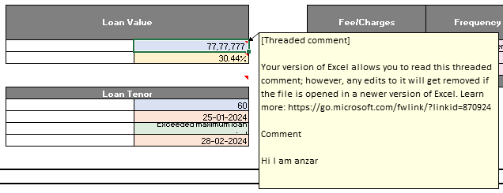

# Comments vs Notes in RadSpreadProcessing

## Environment

| Version | Product | Author | 
| --- | --- | ---- | 
| 2024.1.124 | RadWordsProcessing |[Desislava Yordanova](https://www.telerik.com/blogs/author/desislava-yordanova)| 

## Description
When opening XLSX files in MS Excel, the comments may appear as threaded comments. This article explains the reason behind this behavior.

 

## Solution

The [SpreadProcessing]() library supports both [Comments]() and [Notes]() in Excel. The difference between them is as follows:

- **Comments**: These are the traditional comments that were available in earlier versions of Excel. They are displayed as small red triangles in the corners of cells and can be viewed by hovering over the cell. Each comment can be replied to, forming a thread of information. 

- **Notes**: They are used for making notes or annotations about the data.

Microsoft rebranded their Comments to Notes, and added the possibility to add comments to comments - that is now known as Threaded Comments or just Comments. That is why some documents may have Comments and others - Notes. It depends on the MS Excel version on which the document was generated. 

> For more information about the changes in Excel's functionality, you can refer to the following link: [Comments and Notes Updates in Excel](https://insider.microsoft365.com/en-us/blog/comments-and-notes-updates-in-excel-for-the-web)

Telerik Document Processing Libraries do not have effect over this changed behavior of the mechanism in MS Excel and how the documents are generated or displayed. We just provide both functionalities, Comments and Notes. No matter what document is imported in the SpreadProcessing library, you can iterate both collections and extract whatever data is stored.

## See Also

 * [Comments]()
 * [Notes]()