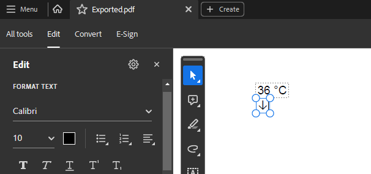

## Environment
| Version | Product | Author | 
| --- | --- | ---- | 
| 2024.1.124 | RadPdfProcessing |[Desislava Yordanova](https://www.telerik.com/blogs/author/desislava-yordanova)| 

## Description

This article shows how to insert special symbols, such as "↓", in a PDF document using RadPdfProcessing.

   

## Solution

When using the Telerik Document Processing's .NET Standard assemblies/NuGet packages and want to export a document to PDF format, the PdfProcessing library needs to have access to the specific font's data so that it can read it and add it to the PDF file. That is why, to allow the library to create and use fonts, you will need to provide an implementation of the FontsProviderBase abstract class and set this implementation to the FontsProvider property of FixedExtensibilityManager. 

```csharp


using System.Diagnostics;
using Telerik.Documents.Core.Fonts;
using Telerik.Windows.Documents.Fixed.FormatProviders.Pdf;
using Telerik.Windows.Documents.Fixed.Model;
using Telerik.Windows.Documents.Fixed.Model.Editing;
using Telerik.Windows.Documents.Fixed.Model.Editing.Tables;

Telerik.Windows.Documents.Extensibility.FontsProviderBase fontsProvider = new FontsProvider();
Telerik.Windows.Documents.Extensibility.FixedExtensibilityManager.FontsProvider = fontsProvider;

RadFixedDocument document = new RadFixedDocument();
RadFixedDocumentEditor editor = new RadFixedDocumentEditor(document);

Table table = new Table();
TableRow row = table.Rows.AddTableRow();
TableCell valueCell = row.Cells.AddTableCell();
Block valueCellBlock = valueCell.Blocks.AddBlock();
valueCellBlock.InsertText(new FontFamily("Arial"),"36 °C");
row = table.Rows.AddTableRow();
valueCell = row.Cells.AddTableCell();
valueCellBlock = valueCell.Blocks.AddBlock();
valueCellBlock.InsertText(new FontFamily("Calibri"), "↓");
editor.InsertTable(table);

string outputdDocumentName = "Exported.pdf";
if (File.Exists(outputdDocumentName))
{
    File.Delete(outputdDocumentName);
}

PdfFormatProvider provider = new PdfFormatProvider();
using (Stream stream = new FileStream(outputdDocumentName, FileMode.OpenOrCreate))
{
    provider.Export(document, stream);
}

Process.Start(new ProcessStartInfo() { FileName = outputdDocumentName, UseShellExecute = true });

internal class FontsProvider : Telerik.Windows.Documents.Extensibility.FontsProviderBase
{
    private readonly string fontFolder = Environment.GetFolderPath(Environment.SpecialFolder.Fonts);

    public override byte[] GetFontData(Telerik.Windows.Documents.Core.Fonts.FontProperties fontProperties)
    {
        string fontFamilyName = fontProperties.FontFamilyName;
        bool isBold = fontProperties.FontWeight == Telerik.Documents.Core.Fonts.FontWeights.Bold;
        string fontFolder = Environment.GetFolderPath(Environment.SpecialFolder.Fonts);
        if (fontFamilyName == "Arial" && isBold)
        {
            using (FileStream fileStream = File.OpenRead(fontFolder + "\\arialbd.ttf"))
            {
                using (MemoryStream memoryStream = new MemoryStream())
                {
                    fileStream.CopyTo(memoryStream);
                    return memoryStream.ToArray();
                }
            }
        }
        else if (fontFamilyName == "Arial")
        {
            return this.GetFontDataFromFontFolder("arial.ttf");
        }
        else if (fontFamilyName == "Calibri" && isBold)
        {
            return this.GetFontDataFromFontFolder("calibrib.ttf");
        }
        else if (fontFamilyName == "Calibri")
        {
            return this.GetFontDataFromFontFolder("calibri.ttf");
        }
        else if (fontFamilyName == "Segoe UI")
        {
            return this.GetFontDataFromFontFolder("segoeui.ttf");
        }

        return null;
    }

    private byte[] GetFontDataFromFontFolder(string fontFileName)
    {
        using (FileStream fileStream = File.OpenRead(this.fontFolder + "\\" + fontFileName))
        {
            using (MemoryStream memoryStream = new MemoryStream())
            {
                fileStream.CopyTo(memoryStream);
                return memoryStream.ToArray();
            }
        }
    }
}

```

## See Also
- [Cross-Platform Support >> Fonts](https://docs.telerik.com/devtools/document-processing/libraries/radpdfprocessing/cross-platform-support/fonts)
- [How to Implement FontsProvider](https://docs.telerik.com/devtools/document-processing/libraries/radpdfprocessing/how-to/howto-implement-fontsprovider)
