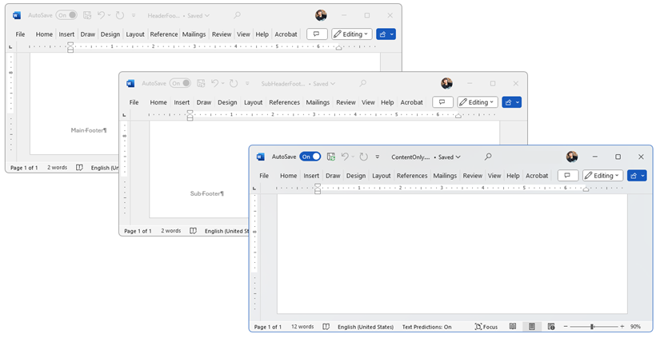
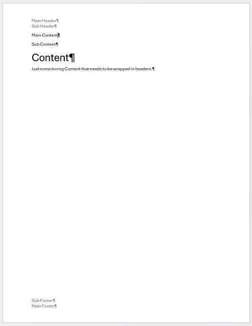

## Environment
| Version | Product | Author | 
| --- | --- | ---- | 
| 2023.3.1106 | RadWordsProcessing |[Desislava Yordanova](https://www.telerik.com/blogs/author/desislava-yordanova)| 

## Description
This tutorial shows how to merge headers, footers, and content from multiple DOCX documents - specifically, append headers and merge the content inside a final document.

#### Headers


#### Footers 


## Solution
To merge the headers, footers, and content in DOCX documents, follow these steps:

1. Use the [DocumentElementImporter]() to prepare a document element from the source document for import into the target document.
2. Merge the headers of the source document with the target document.
3. Merge the footers of the source document with the target document.
4. Use the `RadFlowDocumentEditor` to insert the content of the documents into the final document.

#### Final document 


Here is a sample code snippet that demonstrates how to accomplish this:

```csharp
DocxFormatProvider _DocXProvider = new DocxFormatProvider(); 
string outputFile = @"..\..\MergedResult.docx";
File.Delete(outputFile); 

RadFlowDocument target = _DocXProvider.Import(File.ReadAllBytes(@"..\..\HeaderFooter.docx"));
RadFlowDocument source = _DocXProvider.Import(File.ReadAllBytes(@"..\..\SubHeaderFooter.docx"));
RadFlowDocument contentSource = _DocXProvider.Import(File.ReadAllBytes(@"..\..\ContentOnly.docx"));

MergeHeaders(target, source);
MergeFooters(target, source);

// Merge content
RadFlowDocumentEditor editor = new RadFlowDocumentEditor(target);
BlockBase lastBlock = target.Sections.Last().Blocks.Last();
Telerik.Windows.Documents.Flow.Model.Paragraph p = lastBlock as Telerik.Windows.Documents.Flow.Model.Paragraph;
if (p != null)
{
    editor.MoveToParagraphEnd(p);
}
else
{
    editor.MoveToTableEnd((Telerik.Windows.Documents.Flow.Model.Table)lastBlock);
}

InsertDocumentOptions options = new InsertDocumentOptions();
options.ConflictingStylesResolutionMode = ConflictingStylesResolutionMode.UseTargetStyle;
options.InsertLastParagraphMarker = false;
editor.InsertDocument(source, options);
editor.InsertDocument(contentSource, options);

byte[] resultBytes = _DocXProvider.Export(target);
System.IO.File.WriteAllBytes(outputFile, resultBytes);
Process.Start(outputFile);

private static void MergeHeaders(RadFlowDocument target, RadFlowDocument source)
{
    Header targetHeader = target.Sections.First().Headers.Default;
    Header sourceHeader = source.Sections.First().Headers.Default;

    DocumentElementImporter importer = new DocumentElementImporter(target, source, ConflictingStylesResolutionMode.UseTargetStyle);
    foreach (BlockBase block in sourceHeader.Blocks)
    {
        BlockBase importedBlock = importer.Import(block);
        targetHeader.Blocks.Add(importedBlock);
    }
}

private static void MergeFooters(RadFlowDocument target, RadFlowDocument source)
{
    Footer targetFooter = target.Sections.First().Footers.Default;
    Footer sourceFooter = source.Sections.First().Footers.Default;

    DocumentElementImporter importer = new DocumentElementImporter(target, source, ConflictingStylesResolutionMode.UseTargetStyle);
    int i = 0;
    foreach (BlockBase block in sourceFooter.Blocks)
    {
        BlockBase importedBlock = importer.Import(block);
        targetFooter.Blocks.Insert(i++, importedBlock);
    }
}
```

## Notes
- This solution assumes you have the necessary references and dependencies set up in your project.
- Make sure to adjust the file paths in the code snippet to match the location of your files.
- This code snippet uses the `RadFlowDocument` class from the RadWordsProcessing library.

## See Also
- [RadWordsProcessing Documentation]()
- [RadFlowDocumentEditor]()
- [Headers and Footers]()
