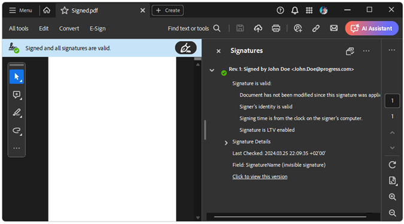

## Environment

| Version | Product | Author | 
| --- | --- | ---- | 
| 2024.1.124 | RadPdfProcessing |[Desislava Yordanova](https://www.telerik.com/blogs/author/desislava-yordanova)| 

## Description

This article shows how to sign PDF documents with invisible signatures. 

## Solution

The invisible signature is created by not setting the size to the signature widget. It can be achieved with the use of signature flags.

**RadPdfProcessing**  offers the ability to set the signature flags. The possible values are as specified in the PDF Standard:

* **None**: The document does not contain signatures.
* **SignaturesExist**: If set, the document contains at least one signature field.
* **AppendOnly**: The document contains signatures that may be invalidated if the file is saved in a way that alters its previous contents.

With this functionality, you can specify that there is a signature, even if the signature itself does not have a visual representation. For example, you can create a signature without visible content (empty widget) and set the flags like with the following code:

```csharp
X509Certificate2 certificate = new X509Certificate2("Certificate.pfx", "Password");
string signatureName = "SignatureName";
SignatureField signatureField = new SignatureField(signatureName)
{
    Signature = new Signature(certificate)
};
SignatureWidget widget = signatureField.Widgets.AddWidget();

PdfFormatProvider provider = new PdfFormatProvider();
RadFixedDocument document = new RadFixedDocument();
RadFixedPage page = document.Pages.AddPage(); 
page.Annotations.Add(widget);
document.AcroForm.FormFields.Add(signatureField);
document.AcroForm.SignatureFlags = SignatureFlags.SignaturesExist | SignatureFlags.AppendOnly;

string signedDocumentFilePath = "Signed.pdf";
File.Delete(signedDocumentFilePath);
using (System.IO.Stream output = new System.IO.FileStream(signedDocumentFilePath, 
    System.IO.FileMode.OpenOrCreate, System.IO.FileAccess.ReadWrite))
{
    provider.Export(document, output);
}

```

 

## See Also

* [Signing a Document with a Digital Signature](})
* [Widgets Types]()
* [Signing a PDF Document with a SignatureWidget]()

