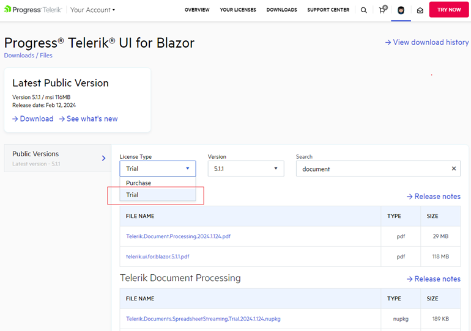
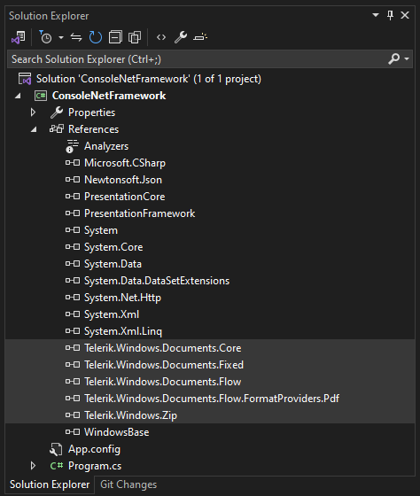
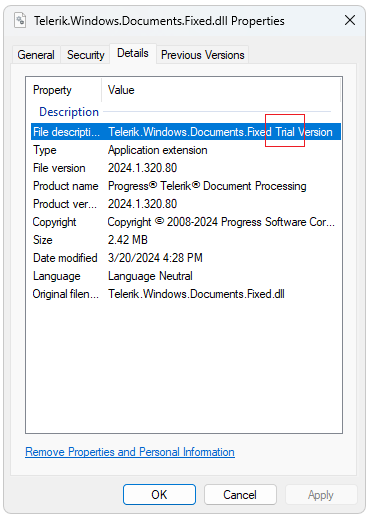
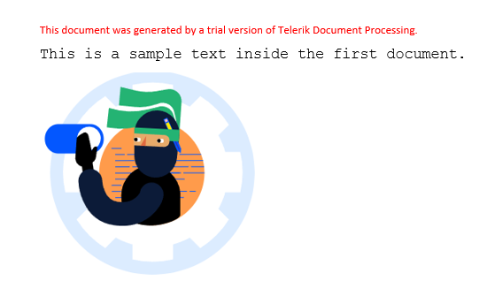
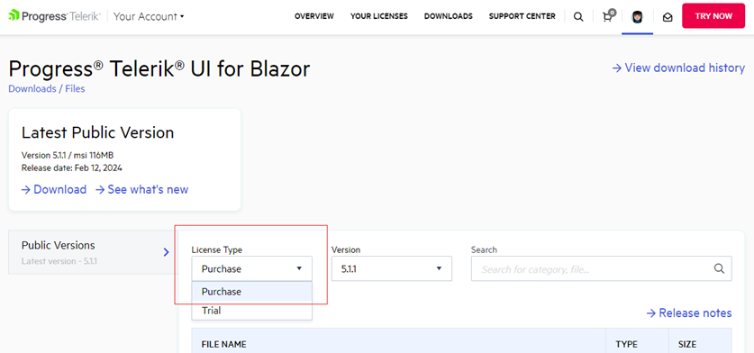
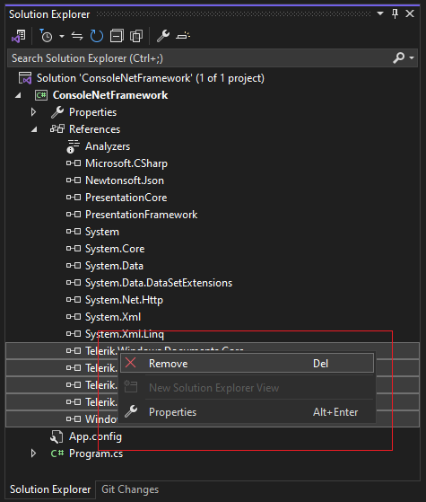
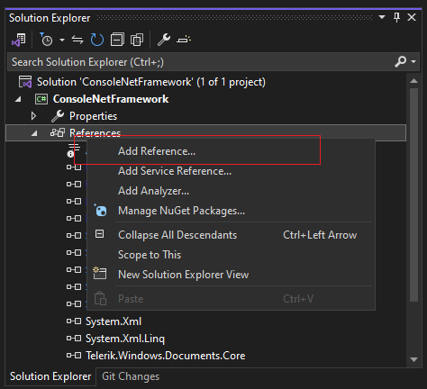
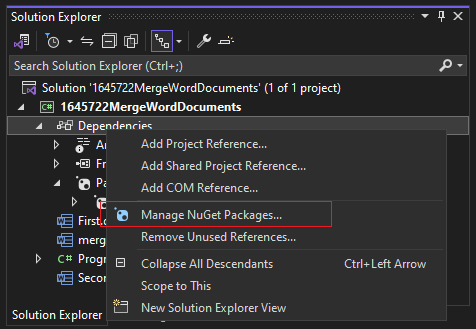
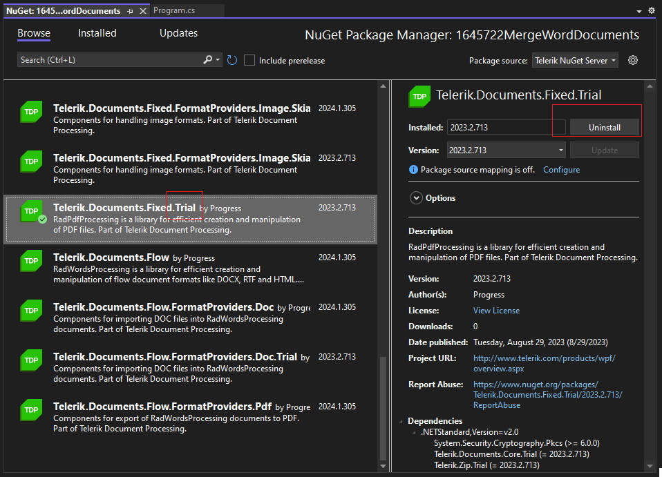
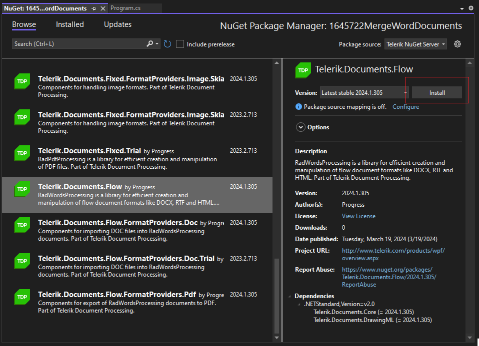

| Version | Product | Author | 
| --- | --- | ---- | 
| N/A | Document Processing Libraries |[Desislava Yordanova](https://www.telerik.com/blogs/author/desislava-yordanova)| 

## Description

This tutorial explains in details how to upgrade your Telerik [Trial]() to a Licensed version of the Document Processing Libraries.

Let's start with having a trial version installed on your machine and a project that uses the trial version:

>caption Access to the Trial version of product files in the Downloads section of your Telerik account

 

>note Telerik Document Processing is a part of several Telerik bundles and is installed following the steps for installing the suite with which you've obtained the product: [Installing on Your Computer]()

If you expand the **References** in the Solution Explorer in Visual Studio, you will see the currently referred assemblies in the project:

>caption Trial Assemblies referred in the project 

  

Navigate to the project's folder and right-click on the .dll to open the Properties dialog to check if the **Trial** .dll is added.

   

>note The only difference between the license and trial versions of the assemblies is that trial assemblies add a copyright message to the produced documents:

  

## Solution

Once you purchase a Telerik license, you will have access to the *Purchase* **License Type** in your Telerik account:

 

Depending on the Telerik product with which you've obtained the Telerik Document Processing, the libraries can be used either through the [available NuGet packages]() or through the assemblies available in the installation folder of the Telerik product.

## Upgrade the Trial Assemblies

1\. **Download** the .msi file for the *Purchase* version.

2\. **Uninstall** the already installed *Trial* version, e.g. from the Windows Control Panel >> Programs and Features.

3\. **Install** the downloaded .msi file in step 1.

4\. Update the references in your project with the assemblies from the licensed installation. It is necessary to delete the old trial assemblies first and then add the licensed ones:

  

  

5\. **Delete** the license.licx file (if such file exists). 

6\. **Rebuild** your project, close Visual Studio and open it again to make sure that no references are kept in the memory by Visual Studio. 

## Upgrade the Trial NuGet packages

1\. Open the **NuGet Package Manager**, e.g. select the Manage NuGet Packages... option

2\. Uninstall any **Trial** Telerik NuGet packages:

3\. Intall the respective **Purchase** version of the NuGet packages, without the word "Trial" in its name:

# See Also

* [Trial vs Licensed version]() 
* [Installing on Your Computer]()
* [Install using NuGet Packages]()
