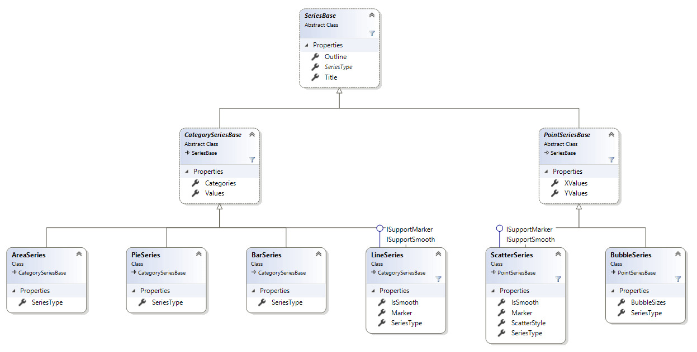
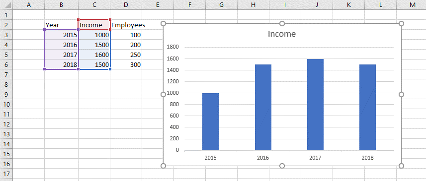
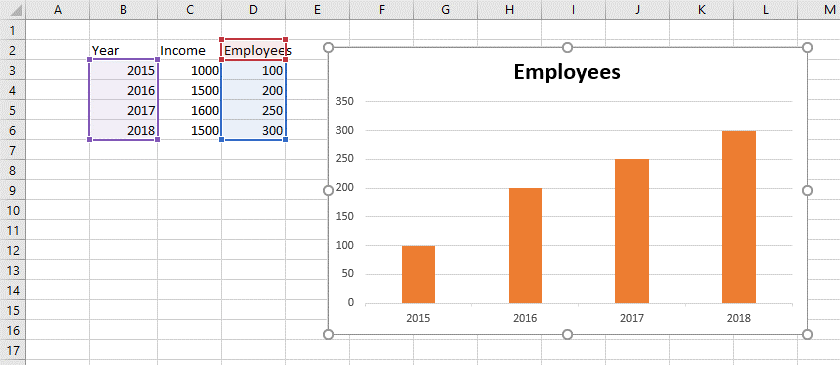
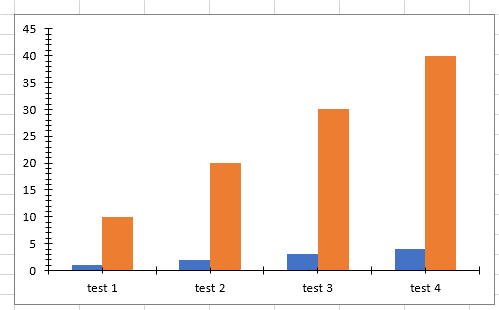
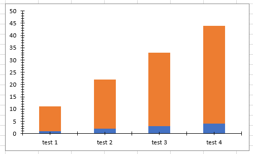
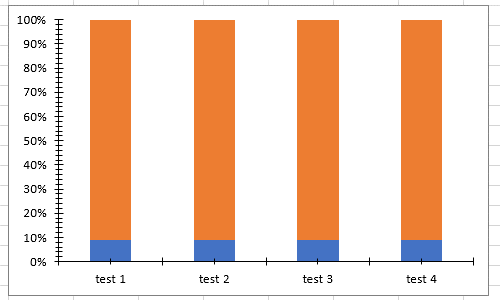

# Working with Series

A series is a set of data - a line or a set of columns, for example. All data plotted on a chart comes from the series object. 

## Series Classes

There are several base classes used to unite the different kinds of series and values they work with.

### SeriesBase Class

The SeriesBase class is the base class for all series in RadSpreadProcessing. It exposes the following members:

* **SeriesType**: Gets the type of the series.
* **Title**: Gets or sets the title of the series.
* **Outline**: Represents the outline of a chart. It is of type [Outline](https://docs.telerik.com/devtools/document-processing/api/Telerik.Windows.Documents.Model.Drawing.Theming.Outline.html).
* **Clone()**: Creates a deep copy of the object and returns the cloning.

The differnt types of charts support different types of series. To meet this need, the base class is inherted by the CategoriesSeriesBase and PointSerierBase base classes representing the different series types.

### CategorySeriesBase

A base class for all series that use Values and Categories.

* **Values**: Gets or sets the data for the values of the series.
* **Categories**: Gets or sets the data for the categories of the series.

The CategorySeriesBase is inherited by the following classes, which represent concrete different types of series:

* **AreaSeries**
* **LineSeries**
* **BarSeries**
* **PieSeries**

### PointSeriesBase

A base class for all series that use X values and Y values.

* **XValues**: Gets or sets the data for the X values of the series.
* **YValues**: Gets or sets the data for the Y values of the series.

PointSeriesBase is inherited by the following classes, which represent concrete different types of series:

* **ScatterSeries**
* **BubbleSeries**

## Add and Remove Series

The adding of the new series is done through the **SeriesCollection** Add() method overloads and removing is done through the Remove() method. The first overload throws an exception when the series parameter passed is not of the correct type and the other Add ()overloads create a series of the appropriate type. The overloads of the base **SeriesCollection** type are listed below:

- public void **Add(SeriesBase series)**
- public SeriesBase **Add(IChartData categoriesData, IChartData valuesData, Title title = null)**
- public SeriesBase **Add()**
- public void **Remove(SeriesBase series)**

To better illustrate how you can change the series of a chart, let's take the sample data and chart from **Figure 1**.

#### Figure 1: Initial state of a chart

#### [C#] Example 1: Add and remove series from a chart

{{region radspreadprocessing-features-charts-working-with-series_0}}
	
	// The worksheet contains a chart of type bar.
	DocumentChart chart = (worksheet.Shapes.First() as FloatingChartShape).Chart;
	SeriesGroup chartComponent = chart.SeriesGroups.First();
	SeriesBase firstSeries = chartComponent.Series.First();
	chartComponent.Series.Remove(firstSeries);
	
	CellRange valuesRange = new CellRange(2, 3, 5, 3); // D3:D6
	CellRange categoriesRange = new CellRange(2, 1, 5, 1); // B3:B6
	CellRange titleRange = new CellRange(1, 3, 1, 3); // B3:B6
	
	WorkbookFormulaChartData valuesData = new WorkbookFormulaChartData(worksheet, valuesRange);
	WorkbookFormulaChartData categoriesData = new WorkbookFormulaChartData(worksheet, categoriesRange);
	Title chartTitle = new FormulaTitle(new WorkbookFormulaChartData(worksheet, titleRange));
	
	SeriesBase newSeries = chartComponent.Series.Add(categoriesData, valuesData, chartTitle);
	Type seriesType = newSeries.GetType(); // Will be of type BarSeries
{{endregion}}

#### Figure 2: Modified series of a chart

The same methods for adding and removing series can be accessed through the concrete SeriesCollection of the concrete SeriesGroup and they will return concrete Series object. 

#### [C#] Example 2: Add series to a chart using concrete SeriesGroup object

{{region radspreadprocessing-features-charts-working-with-series_1}}
	
	BarSeriesGroup chartComponent = chart.SeriesGroups.First() as BarSeriesGroup; BarSeries newSeries = chartComponent.Series.Add(categoriesData, valuesData, chartTitle);
{{endregion}}

##	Iterating the Series of a Chart

You can access the **Series** property of the **SeriesGroup** object contained in the **SeriesGroups** property of the **Chart** object and iterate the **SeriesBase** objects in it. 

#### [C#] Example 3: Iterate series

{{region radspreadprocessing-features-charts-working-with-series_2}}
	
	DocumentChart chart = (worksheet.Shapes.First() as FloatingChartShape).Chart;
	SeriesGroup seriesGroup = chart.SeriesGroups.First();
	
	foreach (CategorySeriesBase series in seriesGroup.Series.Where(s => s is CategorySeriesBase))
	{
	    if (series.Categories.ChartDataType == ChartDataType.Formula)
	    {
	        Worksheet dataWorksheet;
	        IEnumerable<CellRange> categories = (series.Categories as WorkbookFormulaChartData).EnumerateCellRanges(out dataWorksheet);
	    }
	
	    if (series.Values.ChartDataType == ChartDataType.Formula)
	    {
	        Worksheet dataWorksheet;
	        IEnumerable<CellRange> values = (series.Values as WorkbookFormulaChartData).EnumerateCellRanges(out dataWorksheet);
	    }
	}
{{endregion}}

## Making Changes to the Series

You can modify the properties of the base class for all series - SeriesBase.

#### [C#] Example 4: Change series

{{region radspreadprocessing-features-charts-working-with-series_3}}
		
	DocumentChart chart = (worksheet.Shapes.First() as FloatingChartShape).Chart;
	SeriesGroup seriesGroup = chart.SeriesGroups.First();
	CategorySeriesBase firstSeries = seriesGroup.Series.Where(s => s is CategorySeriesBase).First() as CategorySeriesBase;

	firstSeries.Title = new TextTitle("New title");
	firstSeries.Values = new WorkbookFormulaChartData(worksheet, new CellRange(2, 3, 5, 3));
{{endregion}}

## SeriesGroup Class and Properties Related to Specific Series Types

There are properties defined on SeriesGroup level. The SeriesGroup base class represents a group of series and is inherited by the classes holding specific types of series. In addition to the **SeriesType** and **Series** properties, which give you access to the type of the series and the series collection respectively, there are properties implemented in the inheritors. The additional properties are specific for the type of series and give you control over the appearance of all the series in the group.

### BarSeriesGroup

 - **BarDirection**: The property is of Type **BarDirection** and its possible values are **BarDirection.Bar** and **BarDirection.Column**. Setting the BarDirection to **Bar** results in a **bar chart (horizontal)** and setting it to **Column** results in a **column chart (vertical)**.

### DoughnutSeriesGroup

- **HoleSizePercent**: **DoughnutSeriesGroup** defines the **HoleSizePercent** property. This property enables you to get or set the size of the hole of the doughnut relative to the size of the doughnut. *The value of the property is limited to values between 0 and 90*.

## Properties Related to Specific Series Types and Defined in Concrete SeriesBase Implementations

These properties enable you to control the options for each of the series independently.

### BubbleSeries

 - **BubbleSizes**: Gets or sets the data for the bubble size of the series. It is of type [IChartData](}) and you can set it to a specific cell range or directly using values. 

### LineSeries

- **IsSmooth**: A boolean property which determines whether the line of the series is smooth.

- **Marker**: Represents the marker of the series. It is of type **Marker**.

### ScatterSeries

- **IsSmooth**: A boolean property which determines whether the line of the series is smooth.

- **Marker**: Represents the marker of the series. It is of type **Marker**.

- **ScatterStyle**: Determines the style of the scatter series. It is of type ScatterStyle and can have the following values:
    -  **None**: The points on the scatter chart are not connected with straight lines and markers are not drawn.
    - **Line**: The points on the scatter chart are connected with straight lines but markers are not drawn.
    - **LineMarker**: The points on the scatter chart are connected with straight lines and markers are drawn.
    - **Marker**: The points on the scatter chart are not connected with lines and markers are drawn.
    - **Smooth**: The points on the scatter chart are connected with smoothed lines but markers are not drawn.
    - **SmoothMarker**: The points on the scatter chart are connected with smoothed lines and markers are drawn.

#### **[C#] Example 5: Customize the appearance of ScatterSeries**

{{region }}

    SeriesGroup scatterSeriesGroup = chart.Chart.SeriesGroups.First() as ScatterSeriesGroup;
    ScatterSeries scatterSeries = scatterSeriesGroup.Series.First() as ScatterSeries;
    scatterSeries.Marker = new Marker();
    scatterSeries.Marker.Symbol = MarkerStyle.Plus;
    scatterSeries.Marker.Size = 22;
    scatterSeries.Outline.Fill = new SolidFill(Colors.Red);
{{endregion}}

## Series Grouping

Some series groups (Bar, Line and Area) implement the **ISupportGrouping** interface. It defines the **Grouping** property which is of type **SeriesGrouping** enum. The enum contains the following members: **SeriesGrouping.Standard**, **SeriesGrouping.Stacked** and **SeriesGrouping.PercentStacked**. For the Bar chart, the Standard grouping results in a clustered chart. See the following examples for what the results of different grouping looks like.

#### Figure 3: Sample data

#### [C#] Example 6: Creating standard/clustered bar chart with vertical orientation

{{region radspreadprocessing-features-charts-working-with-series_4}}
	
	FloatingChartShape chartShape = worksheet.Shapes.AddChart(new CellIndex(10, 1), selectedRange, ChartType.Bar);
	(chartShape.Chart.SeriesGroups.First() as ISupportGrouping).Grouping = SeriesGrouping.Standard;
{{endregion}}

#### Figure 4: Standard/clustered bar chart with vertical orientation

#### [C#] Example 7: Creating stacked bar chart with vertical orientation

{{region radspreadprocessing-features-charts-working-with-series_5}}
	
	FloatingChartShape chartShape = worksheet.Shapes.AddChart(new CellIndex(10, 1), selectedRange, ChartType.Bar);
	(chartShape.Chart.SeriesGroups.First() as ISupportGrouping).Grouping = SeriesGrouping.Stacked;
{{endregion}}

#### Figure 5: Stacked bar chart with vertical orientation

#### [C#] Example 8: Creating percent-stacked bar chart with vertical orientation

{{region radspreadprocessing-features-charts-working-with-series_6}}
	
	FloatingChartShape chartShape = worksheet.Shapes.AddChart(new CellIndex(10, 1), selectedRange, ChartType.Bar);
	(chartShape.Chart.SeriesGroups.First() as ISupportGrouping).Grouping = SeriesGrouping.PercentStacked;
{{endregion}}

#### Figure 6: Percent-stacked bar chart with vertical orientation

