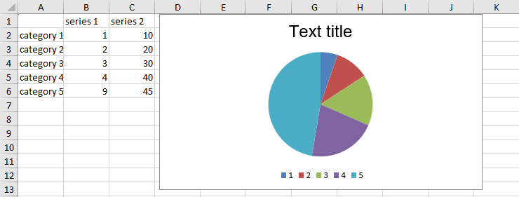

# Chart Title and Legend

You can manipulate the legend and the title of a chart.

## Title

You can access and set the **Title** property of the **DocumentChart** object, which is of type **Title**. The Title property is exposed in both, DocumentChart and SeriesBase classes. Similar to the series of the chart, the title can be a simple *string* value or a reference to data. The reference is not to a CellIndex, but to a CellRange and if the CellRange contains more than one cell, the values of the cells are concatenated.

#### [C#] Example 1: Setting the title of a chart to a string

{{region}}
	
	DocumentChart chart = new FloatingChartShape(worksheet, new CellIndex(0, 0), new CellRange(1, 1, 5, 2), ChartType.Column, ChartType.Pie).Chart;
	
	chart.Title = new TextTitle("Text title");

{{endregion}}

#### [C#] Example 1: Setting the title of a series to a CellRange

{{region}}
	
	BarSeriesGroup columnGroup = chart.SeriesGroups.First() as BarSeriesGroup;
	SeriesBase firstSeries = columnGroup.Series.First();
	
	firstSeries.Title = new FormulaTitle(new WorksheetFormulaChartData(worksheet, new CellRange(0, 0, 0, 1)));

{{endregion}}

#### Figure 1: Chart title

## Legend

The charts use a legend to help users to understand the data plotted on the chart. 

The legend of the chart can be added or edited through the **Legend** property of the **DocumentChart** object. The property is of type **Legend**. The **Legend** type contains one property: **LegendPosition** of type **LegendPosition**, which is an enumeration with four members: **Top**, **Bottom**, **Left** and **Right**. The actual entries of the legend are constructed by the titles of the series.

#### [C#] Example 3: Adding a chart legend
{{region}}

	chart.Legend = new Legend();
	chart.Legend.Position = LegendPosition.Left;
{{endregion}}

#### Figure 2: Chart legend
